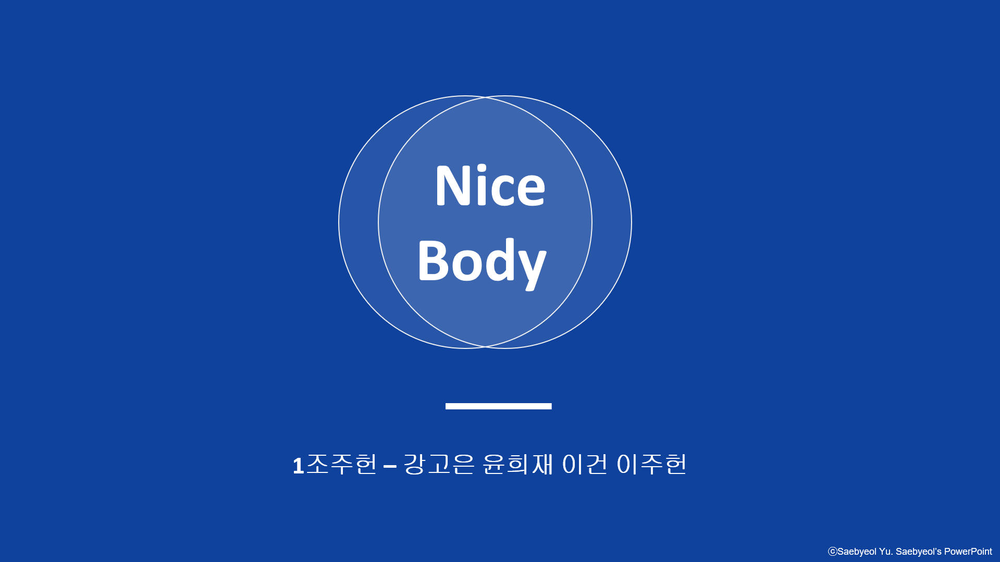

# Nice Body

### : movenet기반 모션인식을 이용한 자세교정 시스템

## 프로젝트 설명

**NiceBody**는 모션인식을 이용한 운동 자세 교정 프로그램 입니다. 기존 운동 프로그램의 문제점은 운동 자세를 알려주고 사용자가 따라하는 형식으로 사용자의 자세를 직접적으로 잡아주지는 않습니다. 하지만 저희 작품은 실시간으로 잘못된 자세를 부위별로 확인할 수 있으며 간편하다는 장점이 있습니다. 저희 작품은 Movenet을 활용하여 사용자의 몸을 인식하고 코사인 유사도를 통해 운동자세의 정확도를 파악할 수 있습니다. 저희가 사용한 Movenet은 사용자의 동작을 인식하고 스켈레톤을 통해 자세를 확인, 정확도를 파악할 수 있습니다. 정확도는 1.0을 기준으로 0.9 이상일 때는 스켈레톤의 색깔이 초록색이 적용되고, 0.9 이하일 경우 빨간색으로 적용됩니다. 이 정확도는 부위마다 적용되며 부정확한 자세를 보다 명확하게 보여줍니다. 

## 주요특징

### MoveNet 기반 모션인식
- 경량화 된 딥러닝 모델 제공
- 신체 동작 추적 딥러닝 모델
- 동작분석, 포즈 인식 관련 응용프로그램에서 사용

### 코사인 유사도를 이용한 정확도 측정

이미지

## 기술 스택

## Developer Info.

| 성명                                      | 역할                                                                                                                                                                                      |
| ----------------------------------------- | ----------------------------------------------------------------------------------------------------------------------------------------------------------------------------------------- |
| [이주헌]    | $\cdot$ Product Manager   $\cdot$  코사인유사도를 이용한 자세 정확도 프로그램 작성 및 movenet 모델링 |
| [강고은] | $\cdot$ 모델과 알고리즘의 통합 및 오류수정                                       |
| [윤희재]    | $\cdot$ 프론트엔드(TKinter를 이용한 UI구현)                                       |
| [이건]  | $\cdot$ movenet의 모델링과 데이터 수집                      |

